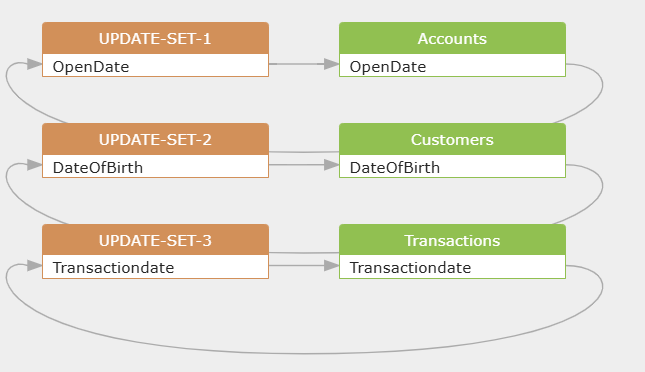
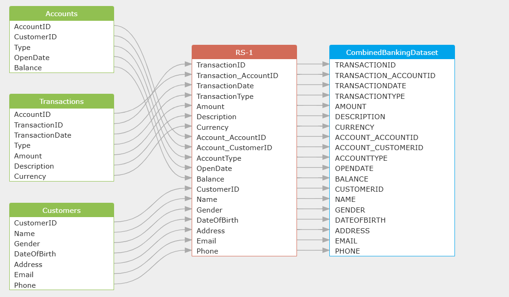
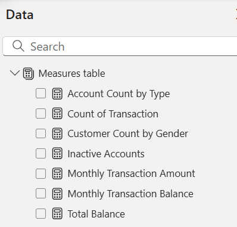
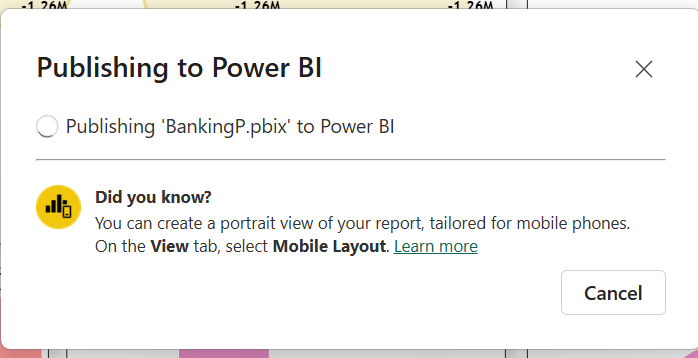
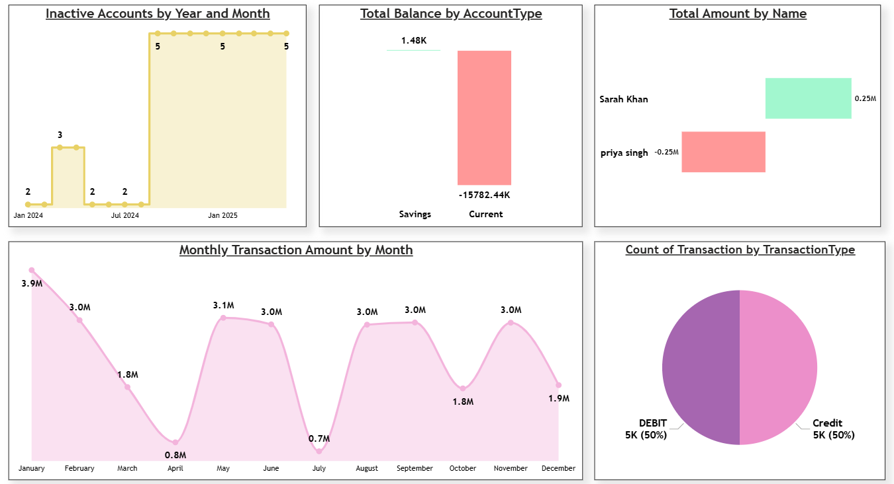
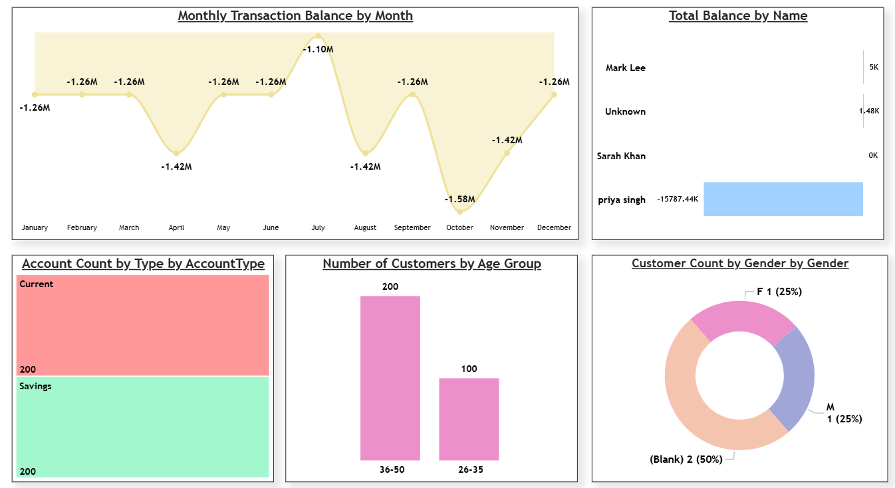
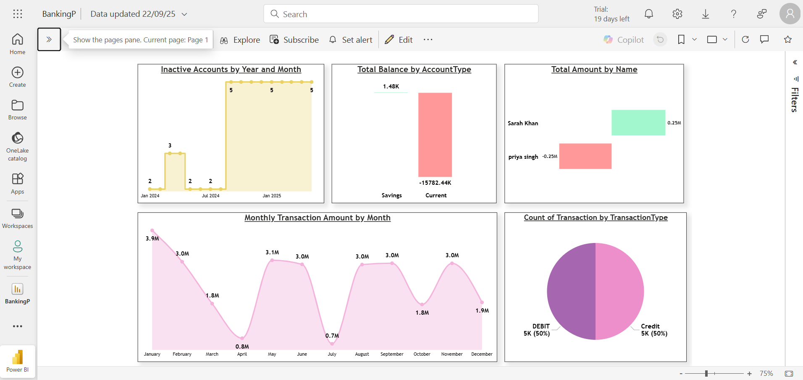
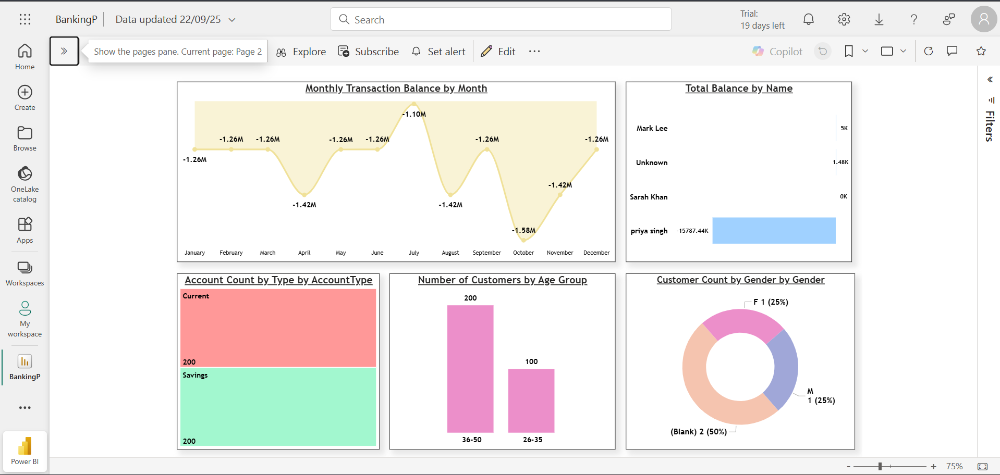

# Banking Dataset Dashboard
### Dashboard Link: https://app.powerbi.com/links/Yk9KGPosak?ctid=a3d2d61d-5751-4b5f-ba05-aec2aeca6ec8&pbi_source=linkShare
## Problem Statement
The Banking Dataset Dashboard analyzes a comprehensive banking dataset to provide insights into customer demographics, account balances, transaction trends, and account activity. It helps stakeholders:
- Understand customer distribution by gender, age, and account type.
- Identify transaction patterns and inactive accounts for better financial management.
- Support data-driven decisions through interactive visualizations and filters to optimize banking operations.
By creating interactive dashboards in Power BI, bank managers and analysts can enhance customer service and operational efficiency.
## Steps Followed
Step 1: Created a database 'Power_BI2' in MS SQL Server and designed tables (Customers, Accounts, Transactions) with intentional data inconsistencies. Used AI (Perplexity) to generate 10,000 synthetic dummy transactions with data issues like mixed formats, nulls, and outliers.

 Step 2: Inserted synthetic data into tables, including mixed date formats, null values, and referential mismatches, then cleaned data by standardizing date formats using AI-assisted UPDATE queries in SQL.

 

 Step 3: Merged the tables into a CombinedBankingDataset using LEFT JOINs in SQL to handle inconsistencies, with transformations and filtering guided by AI (Perplexity) recommendations.

 

 Step 4: Imported the dataset into Power BI using Power Query for further data shaping, created calculated measures in Power Query, and developed visualizations like line charts, bar charts, and pie charts.

Step 5: Added interactive filters and implemented DAX calculations for KPIs such as Customer Gender Distribution and Transaction Volume Trend, based on AI (Perplexity) recommendations for KPIs, DAX expressions, and visualizations.

        Customers by Age Group
        Customer Age = DATEDIFF(CombinedBankingDataset[DateOfBirth], TODAY(), YEAR)
        Customer Age Group = SWITCH(TRUE(), [Customer Age]<=25, "≤25", [Customer Age]<=35, "26-35", [Customer Age]<=50, "36-50", "51+")

---

        Monthly Transaction Amount
        Monthly Transaction Amount = CALCULATE(SUM(CombinedBankingDataset[Amount]), ALLEXCEPT(CombinedBankingDataset, CombinedBankingDataset[TransactionDate].[Month]))

---

        Top N Customers by Transaction Value
        Total by Customer = CALCULATE(SUM(CombinedBankingDataset[Amount]), ALLEXCEPT(CombinedBankingDataset, CombinedBankingDataset[CustomerID]))

---

        Inactive Accounts (last 90 days)
        Inactive Accounts = CALCULATE(DISTINCTCOUNT(CombinedBankingDataset[Account_AccountID]), FILTER(VALUES(CombinedBankingDataset[Account_AccountID]), CALCULATE(MAX(CombinedBankingDataset[TransactionDate])) < TODAY()-90))

---

Step 6: Applied a consistent theme and colors for a professional dashboard layout.

Step 7 : Published report to Power BI Service for sharing and accessibility.

# Snapshot of Dashboard

## Power BI Desktop View
### Dashboard 1:

### Dashboard 2:

## Power BI Service View

### Screenshot 1:

### Screenshot 2:

# Insights
Following inferences can be drawn from the dashboard:

[1] Monthly Transaction Balance by Month
Balances fluctuate between -1.26M and -1.42M, with a peak deficit in October, indicating potential cash flow issues.

[2] Total Balance by Name
Priya Singh shows a significant negative balance of -1578.44K, while Sarah Khan has a positive 0.25M, highlighting individual account disparities.

[3] Account Count by Type
Equal distribution of 200 accounts each for Current and Savings, suggesting balanced account offerings.

[4] Number of Customers by Age Group
36-50 age group dominates with 200 customers, compared to 100 in 26-35, indicating a mature customer base.

[5] Customer Count by Gender
50% blank gender data, with 25% each for Male and Female, suggesting incomplete demographic records.

[6] Overall Banking Insights
Transaction types are evenly split between Debit and Credit (50% each), while inactive accounts peaked at 5 in January 2025, requiring follow-up.

# Conclusion
The Banking Dataset Dashboard offers a detailed view of banking metrics, enabling stakeholders to:
- Identify at-risk accounts and address demographic data gaps.
- Monitor transaction trends and manage inactive accounts effectively.
- Optimize resource allocation and improve customer targeting strategies.
This project showcases skills in SQL data modeling, Power BI visualization, Power Query transformations, and DAX analysis for banking analytics, with AI assistance for data generation and recommendations.

--- 
Author - Rajat Singh B.Tech Computer Science And Engineering | Data Analysis Enthusiast Email: rajattsingh10@gmail.com | LinkedIn: https://www.linkedin.com/in/rajat-singh-bb941924a/
